# SonarQube POC — .NET 10 + GitHub Actions + VS Code

**Audience:** Technical decision-makers evaluating SonarQube for a .NET shop.
**Delivery:** SonarQube Cloud (formerly SonarCloud; SaaS) Free tier against a public GitHub repo. Equivalent to Developer Edition features for this code size — includes PR decoration, branch analysis, taint analysis, Security Hotspots.
**Scope:** Live evidence that Sonar catches what manual review + compilers miss, at three enforcement points — IDE, PR check, dashboard.

---

## 1. Executive summary

| Question typically asked in evaluation | Answer demonstrated by this POC |
|---|---|
| What does Sonar catch that our compiler + reviewers miss? | SQL injection via taint flow, reflected XSS, hardcoded AWS keys, MD5 password hashing, TLS cert bypass, `async void`, float equality, null-deref, high-complexity methods, duplication, dead code — screenshots §4, §5. |
| Where does it run — does it slow devs down? | Three enforcement points, none of them block typing: live IDE squigglies, GitHub PR status check, org dashboard. §5, §6. |
| Can we enforce "don't merge if quality drops"? | Quality Gate blocks the PR merge via GitHub required status check. §4. |
| Do we have to fix all the legacy code first? | No — Clean-as-You-Code model gates only on **new** lines. Legacy rating stays informational. §7. |
| What does this cost? | Free for this POC (public repo + Cloud Free). Real rollout: **SonarQube Cloud Team** (LOC-based monthly subscription for private repos) or **self-host Developer Edition** from ~$2,500/yr per 100k LOC. See [sonarsource.com/plans](https://www.sonarsource.com/plans-and-pricing/) for current figures. §8. |

**POC outcome:**
- Clean `main`: Quality Gate **Passed**, 170 LOC, 4 Medium code smells, 42.4% coverage.
- PR `feature/bad-code` (15 seeded issues): Quality Gate **Failed** on 4 conditions — Reliability E, Security E, 0% new-code coverage, 2 Security Hotspots not reviewed. 24 new issues flagged including 2 taint-analyzed vulnerabilities that only SAST can find.

---

## 2. POC architecture

```
┌──────────────────┐       ┌──────────────────────┐       ┌─────────────────────┐
│  VS Code + IDE   │       │   GitHub Actions     │       │  SonarQube Cloud    │
│   extension      │       │   sonar-scan.yml     │       │   (sonarcloud.io)   │
│ Connected Mode   │──────▶│  dotnet-sonarscanner │──────▶│  rules · QG · taint │
│ live findings    │       │  dotnet-coverage     │       │  PR decoration      │
└──────────────────┘       └──────────────────────┘       └─────────────────────┘
                                                                    │
                                                                    ▼
                                                         ┌─────────────────────┐
                                                         │  GitHub PR check    │
                                                         │  (required, blocks  │
                                                         │   merge on fail)    │
                                                         └─────────────────────┘
```

**Stack:** .NET 10 Web API (`SonarDemo.Api`), xUnit tests with `dotnet-coverage`, GitHub Actions runner, SonarQube Cloud Free tier.

---

## 3. Project & Quality Gate at org level

Single-pane project list with current status.

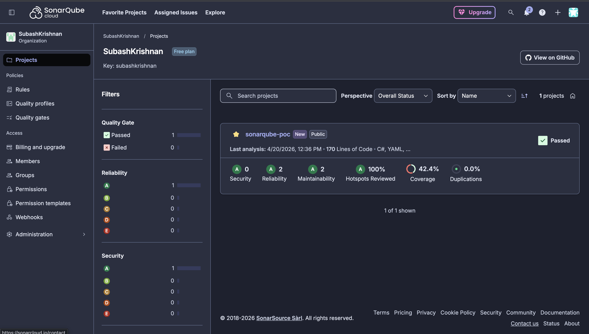

*`SubashKrishnan` org, 1 project, Quality Gate **Passed**, Security A (0), Reliability A (2), Maintainability A (2), Coverage 42.4%, Duplications 0%.*

---

## 4. Clean `main` branch — the "good" baseline

All screenshots below are the clean main branch, before seeded issues were introduced.

### 4.1 Project overview

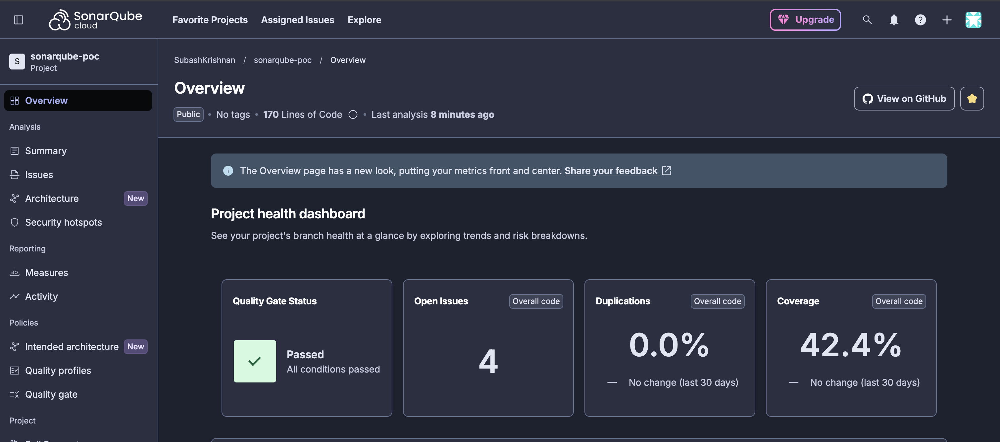

*170 Lines of Code, 4 Open Issues (all Medium smells), 0% duplication, 42.4% coverage, QG Passed.*

### 4.2 Branch summary with commit traceability

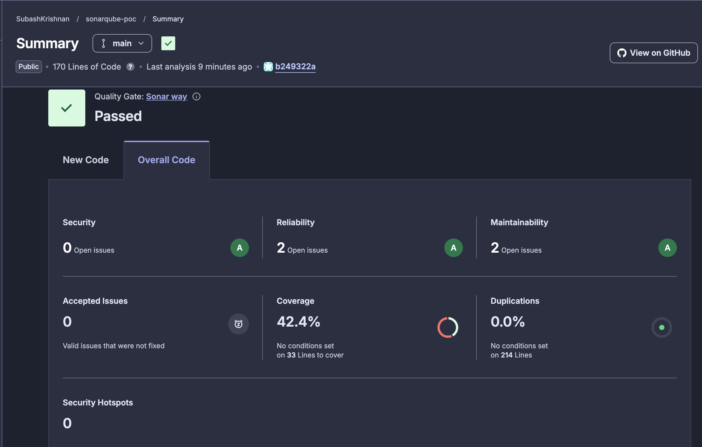

*"Sonar way" Quality Gate — `Passed`. Links to the exact commit `b249322a`. Each metric drills into its own tab.*

### 4.3 Per-domain ratings — Security / Reliability / Maintainability / Hotspots

| Domain | Rating | Screenshot |
|---|---|---|
| Security | A (0 issues) | 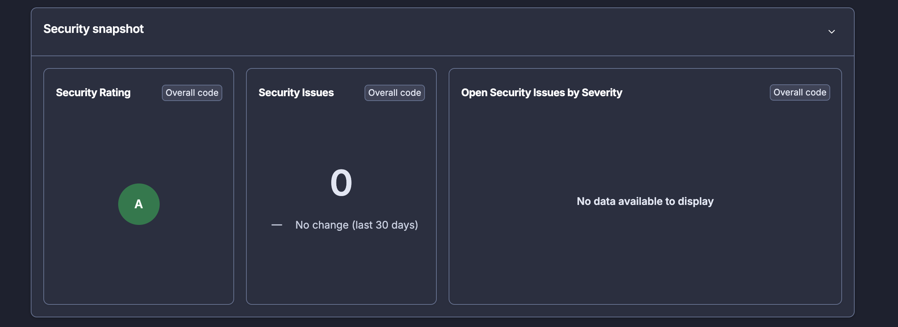 |
| Security Hotspots | A (0 hotspots) | 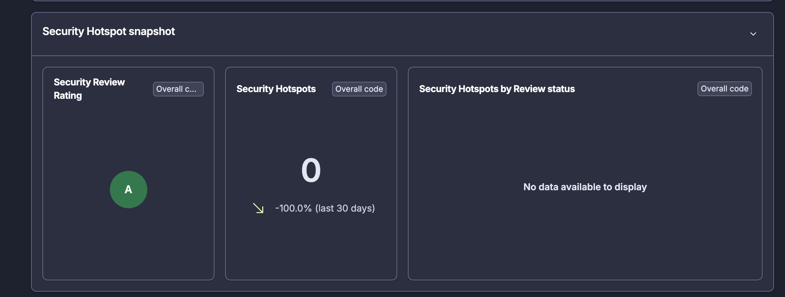 |
| Reliability | A (2 medium) | 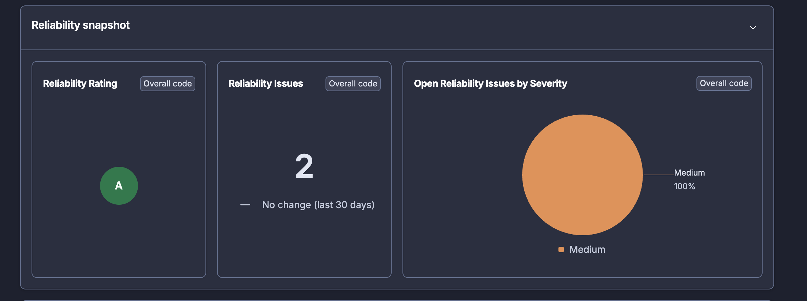 |
| Maintainability | A (2 medium) | 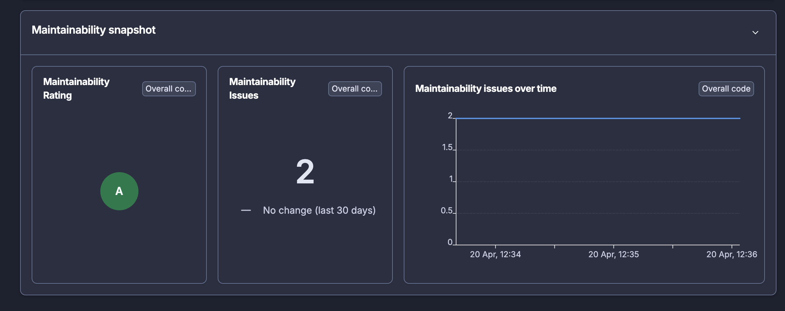 |

*Sonar ratings are **A → E**. A = clean, E = at least one critical issue. These roll up to the Quality Gate.*

---

## 5. PR with seeded issues — the "bad" scenario

`feature/bad-code` branch seeds 15 deliberate issues covering every category Sonar claims to catch.

### 5.1 GitHub PR check fails — merge is blocked

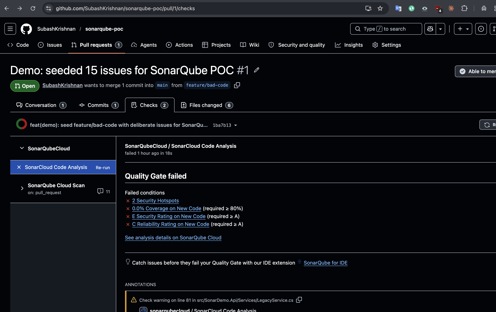

*`SonarQubeCloud / SonarCloud Code Analysis` check **failed** in 18s. 4 failed conditions: 2 Security Hotspots on new code, 0% coverage on new code, Security rating E on new code, Reliability rating C on new code. A required-status-check rule would block merge.*

### 5.2 Inline PR annotations — reviewer sees exactly which lines

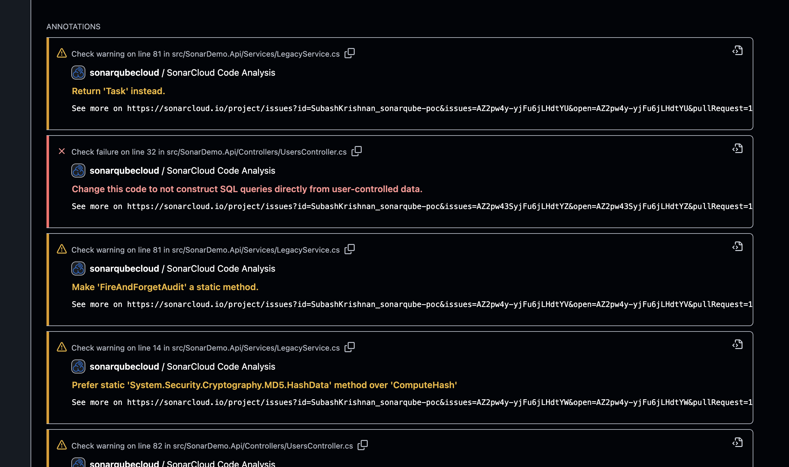

*PR-decoration annotations from SonarQube Cloud posted inline to the GitHub diff — SQLi on `UsersController.cs:32`, MD5 on `LegacyService.cs:14`, `async void` on line 81, "make static" suggestion, "return Task instead". Reviewer gets the finding without leaving the PR.*

### 5.3 PR summary dashboard

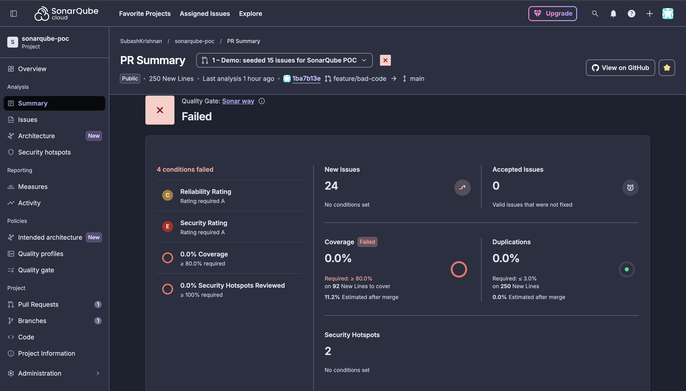

*`Quality Gate: Sonar way — Failed`. 4 conditions failed, 24 new issues, 0% coverage on 92 new lines (required ≥ 80%), 2 new Security Hotspots, Reliability E, Security E. Zero accepted issues (nothing silently suppressed).*

### 5.4 Issues drilldown with filters

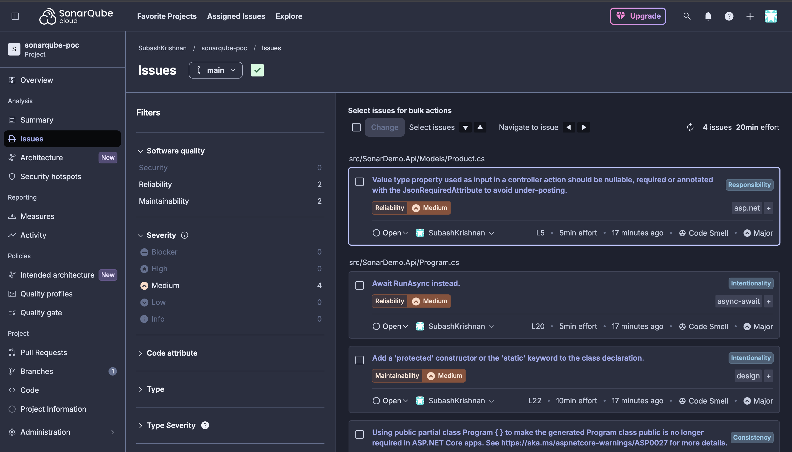

*Filters on Software quality (Security / Reliability / Maintainability), Severity (Blocker / High / Medium / Low / Info), Code attribute, Type, Type Severity. Each issue shows file + line + effort + age + category.*

### 5.5 Individual issue — SQL injection hardcoded credential

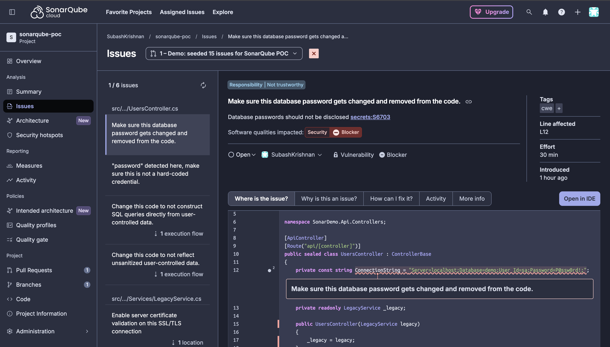

*`secrets:S6703` "Make sure this database password gets changed and removed from the code." Blocker-severity Vulnerability. 30-min effort. Tabs: Where is the issue / Why is this an issue / How can I fix it / Activity. CWE tag attached. Side-panel lists related findings (SQL injection, unsanitized user input, TLS cert).*

### 5.6 Measures bubble chart — complexity vs risk vs coverage

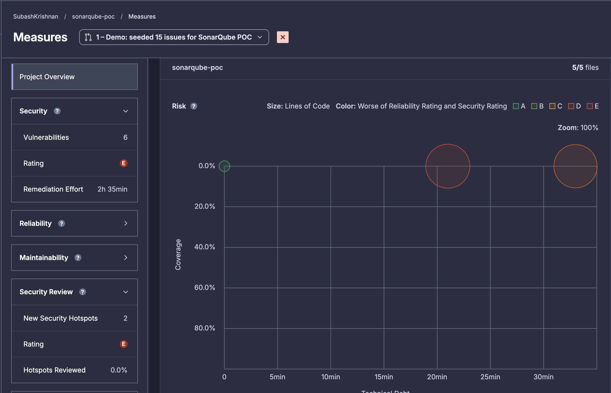

*5 files plotted. X = technical debt (min), Y = coverage %, bubble size = LOC, colour = worse of Reliability/Security rating. Two **E-rated red bubbles** — the SQLi controller and the MD5 legacy service. A "where are the problems" at-a-glance view.*

### 5.7 Code tree with per-folder metrics

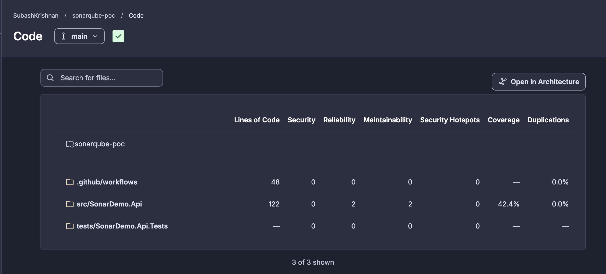

*Per-folder Security / Reliability / Maintainability / Hotspots / Coverage / Duplications. Lets a lead attribute risk to a subsystem instantly.*

---

## 6. IDE extension — shift-left into VS Code

The part that changes developer behaviour day-to-day. Connected Mode uses the server's rule set and syncs server findings locally.

### 6.1 Live inline issues while typing

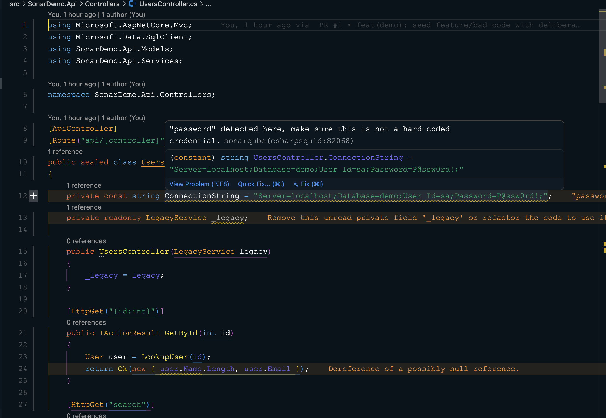

*Tooltip on `UsersController.cs:12`: `"password" detected here, make sure this is not a hard-coded credential. sonarqube(csharpsquid:S2068)`. Next line flags null-deref. No commit needed — these appear as you type.*

### 6.2 SONARQUBE FINDINGS panel — server findings mirrored locally

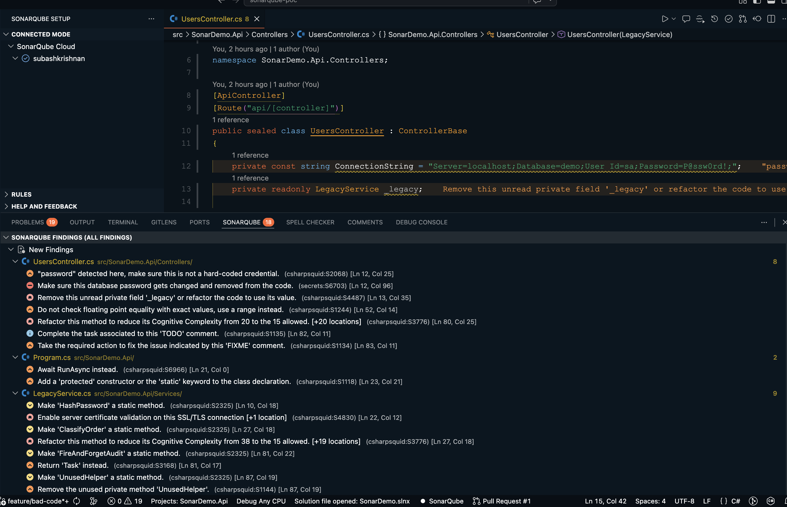

*18 findings synced from SonarQube Cloud, grouped by file, including server-side **taint-analysis** findings (SQLi, XSS) that a local scanner alone cannot produce — these require whole-program data-flow. Connected Mode is why this works.*

### 6.3 Quick-Fix menu on an issue

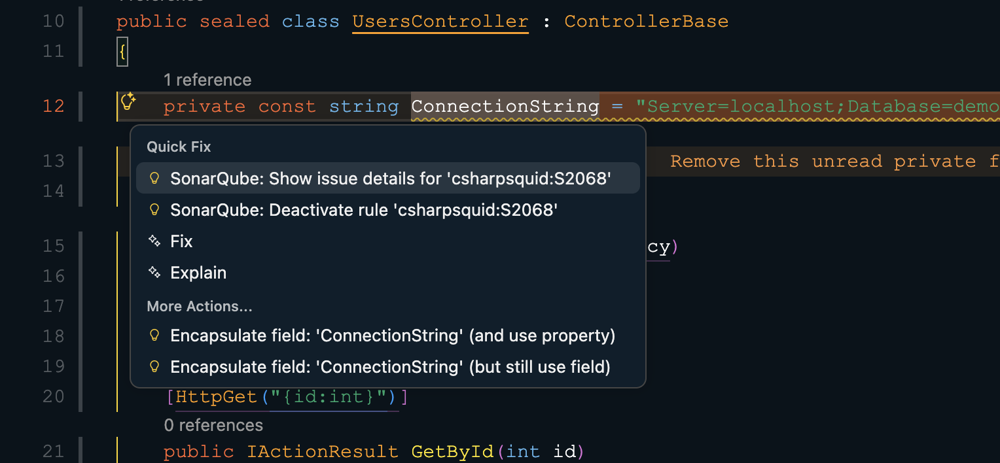

*Right-click on a Sonar finding: `Show issue details`, `Deactivate rule` (mutes locally only — server still reports the rule on the next CI scan, so governance stays intact), `Fix`, `Explain`.*

### 6.4 On-demand analyze from command palette

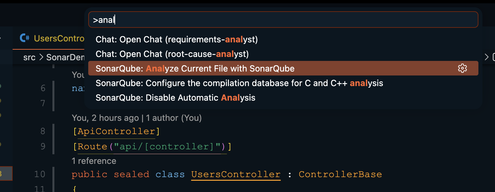

*`SonarQube: Analyze Current File with SonarQube` — devs can re-scan any file without waiting for CI.*

### 6.5 Code-action menu

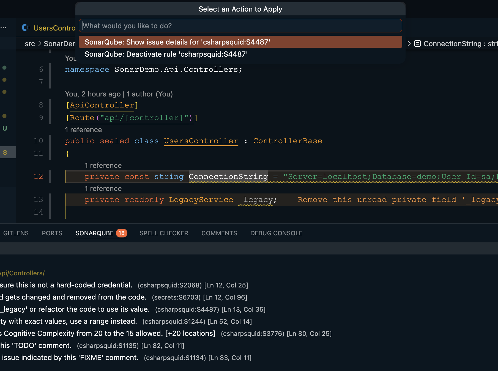

*Same `Show issue details` / `Deactivate rule` available via Code Action dropdown.*

**What the IDE extension does NOT replace:** pre-commit hooks. The common enterprise pattern is to **not** enforce at commit time (slow, easy to bypass with `--no-verify`) and **instead** enforce at PR merge via Required Status Checks. The IDE exists to give the feedback early, not to gate.

---

## 7. Org-level controls — rules, profiles, gates

The three levers an architect will own.

### 7.1 Quality Profiles — which rules are active per language

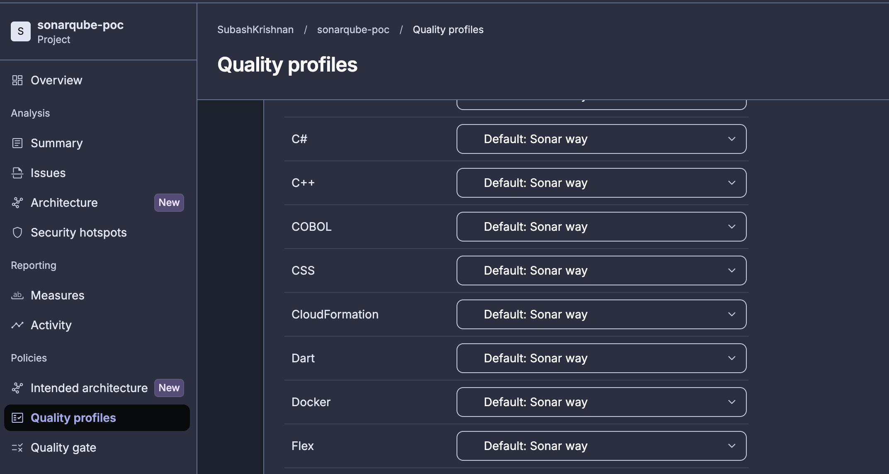

*Every language uses the built-in `Sonar way` profile by default. Paid orgs can clone and customise; Cloud Free uses the built-in. 500+ C# rules active out of the box.*

### 7.2 Quality Gate — pass/fail conditions (Clean-as-You-Code)

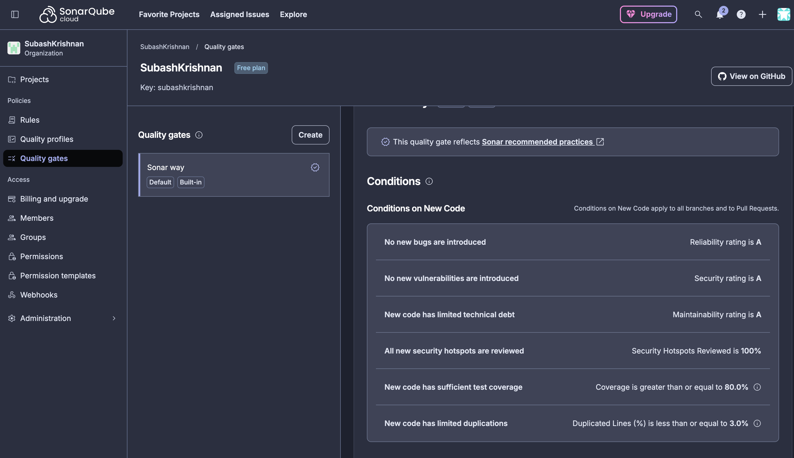

*Built-in `Sonar way` gate, Sonar-recommended practices. Conditions apply to **New Code** only — legacy stays out of scope until you touch it:*
- *No new bugs introduced → Reliability A*
- *No new vulnerabilities → Security A*
- *Limited new technical debt → Maintainability A*
- *All new security hotspots reviewed → 100%*
- *New code coverage ≥ 80%*
- *New code duplication ≤ 3%*

*Cloud Free orgs cannot create custom Quality Gates. The built-in is what every paid tier starts from anyway.*

### 7.3 Rules catalog — 7,616 rules across 30+ languages

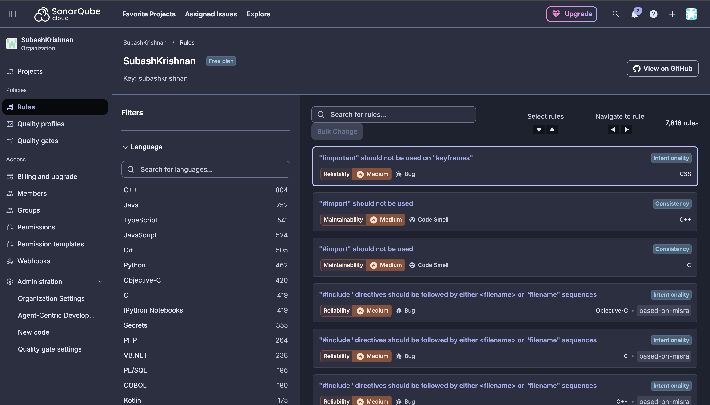

*C++ 804 · Java 752 · TypeScript 541 · JavaScript 524 · **C# 505** · Python 420 · Objective-C 420 · C 410 · IPython 419 · Secrets 355 · PHP 264 · VB.NET 230 · PL/SQL 186 · COBOL 180 · Kotlin 175 · …*

*Rules are tagged to OWASP Top 10, CWE, CWE/SANS Top 25, PCI-DSS, STIG — the compliance evidence a regulator will ask for.*

---

## 8. Problem → Sonar control → edition required

| Problem | Sonar control | Screenshot | Minimum edition |
|---|---|---|---|
| Bug shipped because reviewer missed it | 505 C# rules + 6 built-in QG conditions | §4.3, §5.4 | **Free / Community** |
| SQL injection via concatenated string | **Taint analysis** (inter-procedural data flow) | §5.2, §5.5, §6.2 | **Developer / Cloud Free on public repo** |
| Reflected XSS | Taint analysis | §5.2, §6.2 | Developer / Cloud Free public |
| Hardcoded AWS key, JWT key, DB password in config | **Secrets detection** (355 rules) | §5.5, §6.1 | Free / Community |
| MD5 / weak crypto, TLS cert bypass | **Security Hotspot** rules with reviewer workflow | §5.1, §6.2 | Free / Community |
| Coverage silently drops | **Coverage on new code** gate condition (80% default) | §5.1, §5.3, §7.2 | Free / Community |
| `async void`, float ==, null-deref | Reliability rules | §5.2, §6.2 | Free / Community |
| 20-branch god-method, dead code, duplication | Cognitive Complexity + dead-code + duplication rules | §5.2, §5.4, §6.2 | Free / Community |
| PR merged despite failing quality | **Quality Gate** as GitHub required status check | §5.1 | Free / Community |
| Reviewer has to leave GitHub to see findings | **PR decoration** — inline annotations | §5.2 | **Developer / Cloud Free public** |
| Feature branches not analysed, only main | **Branch analysis** | §4.2, §7.2 | **Developer / Cloud Free public** |
| Dev rediscovers the same issue after commit | **SonarQube for IDE** in Connected Mode | §6 | Free / Community |
| Can't refactor legacy without breaking existing code | **Clean-as-You-Code** model (gate on new code) | §7.2 | Free / Community |
| Compliance needs OWASP / CWE / PCI evidence | Rule tagging + **compliance reports** | §7.3 | Free (tags) / **Enterprise** (PDF report) |
| Portfolio view across many repos | **Applications & Portfolios** | — (out of scope) | **Enterprise** |
| AI-generated code shipped un-reviewed | **AI Code Assurance** + `Sonar way for AI` gate | — (2026 feature) | Developer+ |

---

## 9. How to reproduce

**Prereqs:** .NET 10 SDK, GitHub account, VS Code.

1. **Fork / clone** `github.com/SubashKrishnan/sonarqube-poc` (public).
2. **Sign in** to [sonarcloud.io](https://sonarcloud.io) with GitHub, import the repo under a personal org.
3. **Generate a user token** in Account → Security.
4. **Add repo secret** `SONAR_TOKEN` = generated token.
5. **Push to main** → GitHub Actions runs `.github/workflows/sonar-scan.yml`:
   ```
   dotnet-sonarscanner begin /k:… /o:… /d:sonar.token=$SONAR_TOKEN
   dotnet restore && dotnet build --no-restore
   dotnet-coverage collect "dotnet test" -f xml -o coverage.xml
   dotnet-sonarscanner end /d:sonar.token=$SONAR_TOKEN
   ```
6. **Open a PR** from `feature/bad-code` → SonarQube Cloud posts the Check + inline annotations.
7. **Install "SonarQube for IDE"** in VS Code. The shared `.sonarlint/connectedMode.json` auto-binds:
   ```json
   {
     "sonarCloudOrganization": "subashkrishnan",
     "projectKey": "SubashKrishnan_sonarqube-poc"
   }
   ```
   Sign in to SonarQube Cloud from the extension, reload — 18 findings appear in the SONARQUBE FINDINGS panel.

---

## 10. Honest POC limitations

- **Public repo only.** Cloud Free requires public visibility. For private code, pay Cloud Team or self-host.
- **Custom Quality Gates unavailable** on Cloud Free — the built-in `Sonar way` is used.
- **No AI Code Assurance / AI CodeFix** demonstrated — require paid tier.
- **No portfolio / OWASP-PDF report** — Enterprise feature.
- **Coverage is 42%**, not 80% — gated only on **new-code** coverage, which is how it should be enforced. Legacy coverage catch-up is a separate workstream.
- **Scan time:** ~18 s for 170 LOC on a GitHub-hosted runner. Real repos (50k–500k LOC) typically scan in 3–15 min with cache.

---

## 11. Repo layout

```
sonarqube-poc/
├── SonarDemo.slnx                         # .NET solution (XML-format slnx)
├── .github/workflows/sonar-scan.yml       # CI scanner + coverage
├── .sonarlint/connectedMode.json          # IDE auto-binding (shared)
├── src/SonarDemo.Api/                     # .NET 10 Web API
│   ├── Controllers/ProductsController.cs  # clean on main
│   ├── Controllers/UsersController.cs     # seeded on feature/bad-code
│   ├── Services/ProductService.cs         # clean
│   ├── Services/LegacyService.cs          # seeded on feature/bad-code
│   ├── Models/{Product,User}.cs
│   └── appsettings.json                   # hardcoded secrets on feature/bad-code
├── tests/SonarDemo.Api.Tests/             # xUnit, 6 tests
└── docs/screenshots/                      # 22 screenshots referenced above
```

---

*POC by Subash Krishnan · 2026-04-20 · commit `b249322a` on `main` / PR #1 on `feature/bad-code`.*
